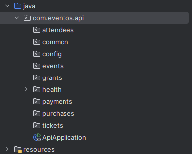
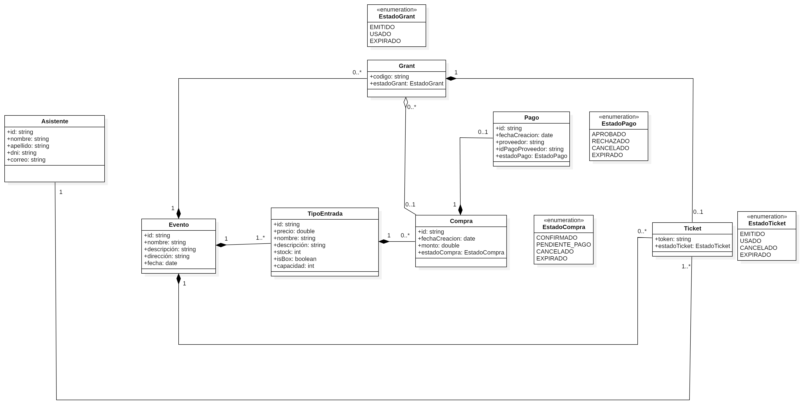
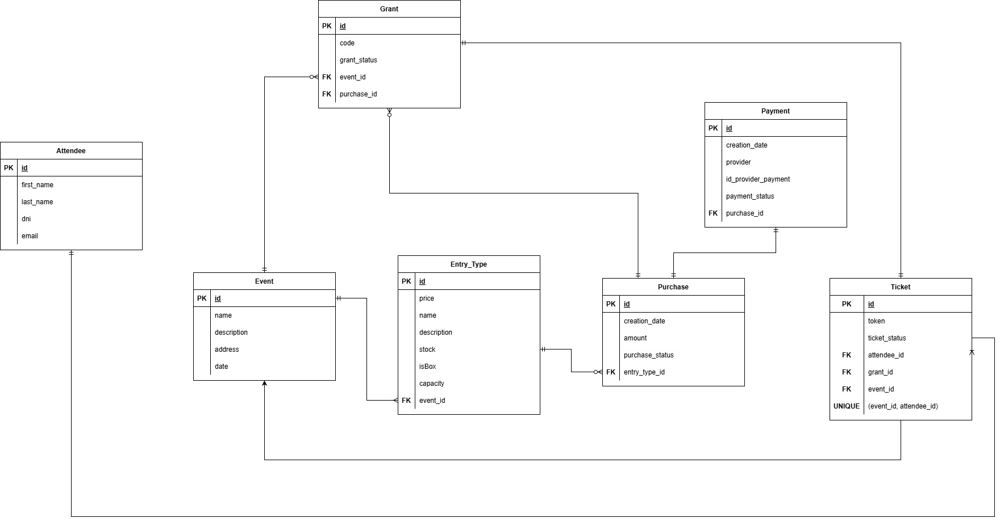

> Este documento evoluciona junto con la implementación del sistema.

# Arquitectura Backend - Eventos API

## 1. Contexto
El sistema consta de un frontend web, un backend API y una base de datos relacional. El presente documento describe la arquitectura del backend.
	
---

## 2. Estilo de Arquitectura
### 2.1 Package-by-feature
El código está siendo organizado siguiendo un enfoque package-by-feature, donde cada paquete representa
una capacidad de dominio (events, tickets, grants, payments, etc.), Dentro de cada feature se mantiene una 
estructura consistente (controller, DTO, service, domain, repository, persistence) para separar 
responsabilidades, garantizando una alta cohesión y un bajo acoplamiento.

**Figura 1.** Estructura de paquetes del sistema.

---

### 2.2 Capas internas y reglas de dependencia
Cada feature del backend sigue una estructura interna con el objetivo de separar responsabilidades y reducir el acoplamiento entre componentes.

Las capas internas son:

- **Controller**: Expone la API REST, gestiona la comunicación HTTP. Naturalmente, no contiene lógica de negocio.
- **Service**: Implementa los casos de uso de la aplicación y coordina la ejecución de reglas de negocio.
- **Domain**: Contiene el modelo del dominio y las reglas de negocio.
- **Repository (interface)**: Define los contratos de acceso a datos requeridos por la capa de servicio.
- **Persistence**: Implementa finalmente los repositorios utilizando tecnologías de persistencia y realiza el mapeo a la base de datos.

#### Reglas de dependencia

- Los **controllers** solo pueden depender de **services** y **DTOs**.
- Los **services** dependen del **domain** y de **interfaces de repository**, nunca de implementaciones concretas.
- El **domain** no depende de frameworks, controladores ni mecanismos de persistencia.
- La capa de **persistence** puede depender de frameworks externos, pero no contiene lógica de negocio.
- Las dependencias siempre apuntan hacia el dominio, evitando referencias cruzadas entre features.

---

## 3. Modelo de dominio
**Figura 2.** Modelo de dominio del sistema de gestión de eventos

El presente modelo de dominio busca representar las principales entidades del sistema y sus relaciones, capturando las reglas de negocio
más relevantes del sistema. Entre las relaciones y  entidades más importantes se identifican las siguientes:

- **Evento – TipoEntrada**: un evento define uno o más tipos de entrada, cada uno con su propio precio y capacidad (esto último en el caso de boxes).
- **Compra – Grant**: una compra genera uno o más grants. En compras personales, el sistema genera un único grant que es canjeado automáticamente.
- **Grant – Ticket**: un grant representa un código canjeable que genera exactamente un ticket.
- **Ticket – Asistente**: cada ticket se asocia a un asistente que representa a la persona que hará uso de la entrada.
- **Ticket – Evento**: todo ticket corresponde a un evento específico y es válido únicamente dentro de su vigencia.

---

## 4. Token/QR y validación de acceso
En el presente sistema, el **QR** no se modela como una entidad independiente del dominio. En su lugar, el acceso se representa mediante un **Ticket**, el cual contiene
un atributo `token` único. El QR es simplemente la **representación visual** (codificación) de dicho `token`.

### 4.1 Generación del Token/QR

- Todo **Ticket** poseé un `token` **único** en el sistema.
- El `token` se genera al momento de emitir el Ticket, ya sea por:
  - **Compra confirmada** (emisión directa de tickets), o
  - **Canje de Grant** (cada grant canjeado emite exactamente 1 ticket).
- La visualización del QR se obtiene codificando el `token` (por ejemplo, como QR estándar) para que pueda ser escaneado en el ingreso.

### 4.2 Política de validación de acceso (one-time entry)
Se adopta una política de **uso único** para evitar que un QR sea reutilizado.
Durante el escaneo, el backend valida el `token` y, si el ticket es válido, lo marca como **USADO**.

Estados sugeridos para Ticket:
- `ISSUED`: emitido y aún no usado.
- `USED`: ya utilizado para ingresar.
- `CANCELLED`: anulado (p. ej., reembolso).
- `EXPIRED`: fuera de vigencia (p. ej., evento finalizado).

### 4.3 Proceso de escaneo (resumen)
Cuando un usuario presenta el QR en el ingreso:

1. El scanner envía el `token` al backend.
2. El backend busca el Ticket asociado al `token`.
3. Se valida:
   - existencia del ticket,
   - vigencia (por fecha/estado del evento),
   - estado del ticket (`ISSUED`).
4. Si es válido, se registra el ingreso:
   - se actualiza el estado a `USED`,
   - se almacena fecha/hora de uso (`usedAt`) y, opcionalmente, el identificador del dispositivo/operador.
5. Se responde con **ALLOW** (permitir) o **DENY** (denegar).

### 4.4 Sobre la concurrencia (doble escaneo)
Para evitar aceptar el mismo ticket 2 veces (por ejemplo, dos escaneos casi simultáneos), la transición `ISSUED → USED` debe realizarse de forma **atómica** (en una sola 
operación de actualización en BD). Si la actualización no afecta ningún registro, el ticket se considera ya usado o inválido. 

---

## 5. Persistencia y Base de Datos
**Figura 3.** Modelo de dominio del sistema de gestión de eventos

